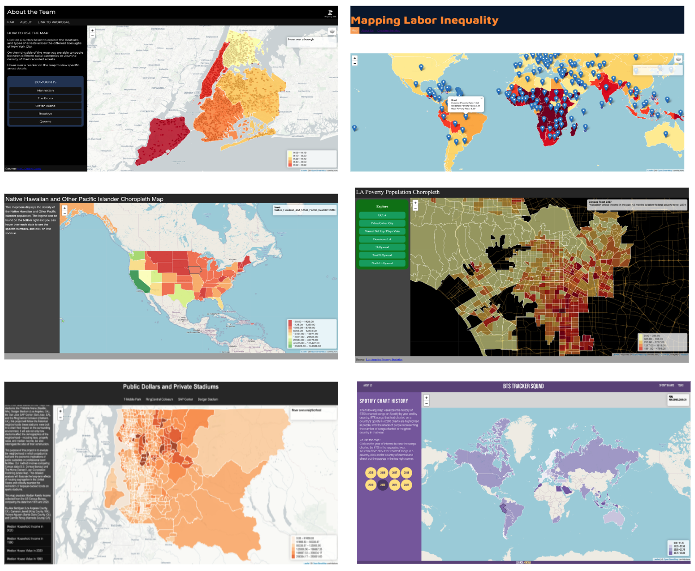

# Week 8

Zoom: https://ucla.zoom.us/j/91538839328

## Today's agenda:

- This session will be recorded
- Concerns/questions/comments, all welcome!
- Let's meet! My office hours are Thursdays from 1-3, or by email appointment ([schedule here](https://calendly.com/yohda/dh151))

## Choropleth Gallery

- [Link to assignments](https://github.com/yohman/22S-DH151/discussions/16)

## Special guest: Alesha Unpingco

Alesha has over 10 years UX design, prototyping, and programs experience in higher ed, nonprofits, startups, advertising, and tech. At Apple, she currently manages a team of designers, prototypers, and artists. Prior to Apple, she worked at Google on VR/AR design and cross-platform social experiences for video games. In addition to bringing human-centered design experiences to bleeding edge tech, she's passionate about using design thinking to align teams and empower people.

## Week 8 Lab
- [Mapathon: Creating filters | Mapbox Basemaps](Lab)

## Next week: Mariah Tso, The Navajo Cartographer

In the news:
- [Zapotec in 90006, K’iche’ in 90057: New map highlights L.A.’s Indigenous communities (LA Times)](https://www.latimes.com/california/story/2021-07-07/la-me-indigenous-map-los-angeles)
- [We are Here Indigenous Diaspora in Los Angeles](https://storymaps.arcgis.com/stories/618560a29f2a402faa2f5dd9ded0cc65) 
CIELO, UCLA AISC, UCLA Promise Institute for Human Rights, UCLA Bunche Center

## Assignments

### Individual Assignment: Thinking Cap on "Critical Cartography"

Read the following article.

Harley, J. B. (1989). Deconstructing the map. Cartographica: The international journal for geographic information and geovisualization, 26(2), 1-20. This is a classic text by Brian Harley – one of the first Foucauldian analyses of mapping.
https://quod.lib.umich.edu/p/passages/4761530.0003.008/--deconstructing-the-map?rgn=main;view=fulltext

Reflect on the article. Write down your thoughts. You are not asked to answer all these questions, but here are some prompts: What concerns you? How has your thinking about maps, cartography, and GIS shifted... or not? What do you think of your responsibility as a steward to your maps?

Submit your thinking cap [here](https://github.com/yohman/22S-DH151/discussions/17).

### Group Assignment

With only three weeks left until the final project deadline, submit a progress update report. The report must include:

- at least one new feature to the maproom
- a description of these features and any other additions to the group project
- a schedule of deliverables until the final
- concerns

Submit your status report [here](https://github.com/yohman/22S-DH151/discussions/18).