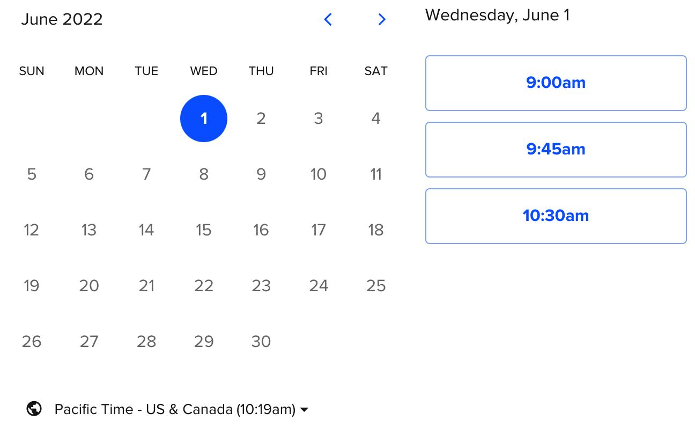

# Week 9

Zoom: https://ucla.zoom.us/j/91538839328

## Today's agenda:

- This session will be recorded
- Concerns/questions/comments, all welcome!
- Let's meet! My office hours are Thursdays from 1-3, or by email appointment ([schedule here](https://calendly.com/yohda/officehours))

## Special guest lecture: Mariah Tso, The Navajo Cartographer

In the news:
- [Zapotec in 90006, K’iche’ in 90057: New map highlights L.A.’s Indigenous communities (LA Times)](https://www.latimes.com/california/story/2021-07-07/la-me-indigenous-map-los-angeles)
- [We are Here Indigenous Diaspora in Los Angeles](https://storymaps.arcgis.com/stories/618560a29f2a402faa2f5dd9ded0cc65) 
CIELO, UCLA AISC, UCLA Promise Institute for Human Rights, UCLA Bunche Center

## Week 9 Lab
- [Charts and Tables](Lab)

# Next week is memorial day

Make up plan is to have each group meet with me for 30-45 minutes.

### May 31 (Tuesday)

Choose a slot for May 31:

### June 1 (Wednesday)

Choose a slot for June 1:

# Assignments

## Group Assignment #4
- Instructions [here](/Group%20Assignments/GroupAssignment4.md)
